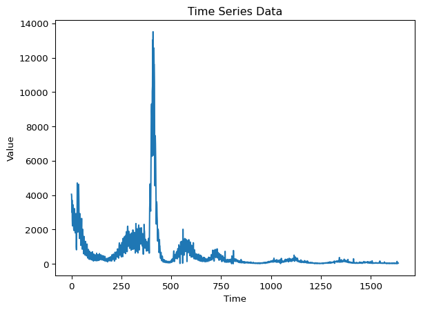
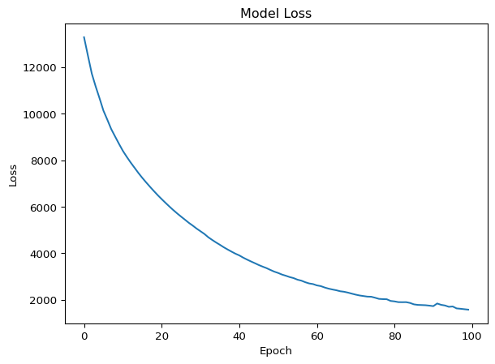
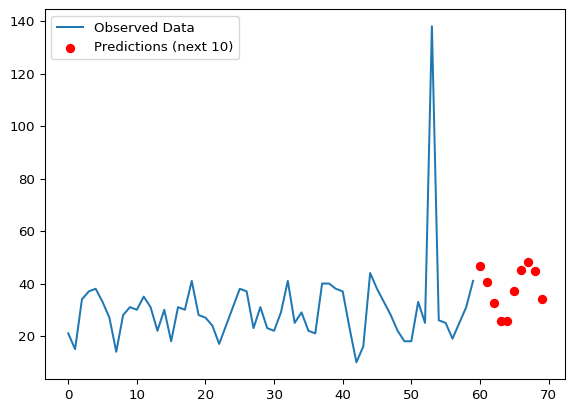

``` python
import numpy as np
from tensorflow.keras.models import Sequential
from tensorflow.keras.layers import LSTM, Dense

# --- 1. Loading data from data/covid_data_utah.csv ---
data = np.genfromtxt(
    fname='data/covid_data_utah.csv',
    delimiter=',',
    skip_header=1,
    usecols=[1],
    dtype=np.float32
    )
```

This is how the data looks like (timeseries plot):

``` python
import matplotlib.pyplot as plt
plt.plot(data)
plt.title('Time Series Data')
plt.xlabel('Time')
plt.ylabel('Value')
plt.show()
```



Since the second half is normalized, we will focus on it for the
training:

``` python
data = data[len(data)//2:]

# --- 2. Prepare sequence data (look-back=10) ---
look_back = 10
X, y = [], []

for i in range(len(data) - look_back):
    X.append(data[i:i+look_back])
    y.append(data[i+look_back])

X = np.array(X)
y = np.array(y)

# Reshape for LSTM: (samples, timesteps, features)
X = X.reshape((X.shape[0], X.shape[1], 1))
```

Now we build the LSTM model and visualize the architecture:

``` python
# --- 3. Build model ---
model = Sequential()
model.add(LSTM(50, activation='tanh', input_shape=(look_back, 1)))
model.add(Dense(1))
model.compile(optimizer='adam', loss='mse')

# Plotting the architecture
from tensorflow.keras.utils import plot_model
plot_model(model, to_file='lstm_model.png', show_shapes=True)
```

    /workspaces/estimate_prevalence/.venv/lib/python3.11/site-packages/keras/src/layers/rnn/rnn.py:199: UserWarning: Do not pass an `input_shape`/`input_dim` argument to a layer. When using Sequential models, prefer using an `Input(shape)` object as the first layer in the model instead.
      super().__init__(**kwargs)


Training the model and making multi-step predictions:

``` python
# --- 4. Train ---
model.fit(X, y, epochs=100, batch_size=16, verbose=0)

# Plotting the training loss
history = model.history.history
plt.plot(history['loss'])
plt.title('Model Loss')
plt.ylabel('Loss')
plt.xlabel('Epoch')
plt.show()
```



``` python
# --- 5. Predict next 10 values ---
forecast_horizon = 10
future_predictions = []
current_sequence = data[-look_back:].reshape(1, look_back, 1)

for _ in range(forecast_horizon):
    next_val = model.predict(current_sequence, verbose=0)[0][0]
    future_predictions.append(next_val)
    # slide window forward by dropping the oldest value and appending the new prediction
    current_sequence = np.concatenate(
        [current_sequence[:, 1:, :], np.array([[[next_val]]], dtype=np.float32)],
        axis=1,
    )

print(f"Next {forecast_horizon} value predictions:", future_predictions)
```

    Next 10 value predictions: [np.float32(46.752495), np.float32(44.202854), np.float32(33.53234), np.float32(27.918453), np.float32(32.95007), np.float32(42.77149), np.float32(50.53554), np.float32(53.92978), np.float32(52.9334), np.float32(45.93794)]

We now visualize the observed data and the prediction

``` python
data_last_60 = data[-60:]

# Plot observed data
plt.plot(data_last_60, label='Observed Data')

# Plot multi-step predictions
future_x = np.arange(len(data_last_60), len(data_last_60) + forecast_horizon)
plt.scatter(future_x, future_predictions, color='red', label='Predictions (next 10)')

plt.legend()
plt.show()
```


